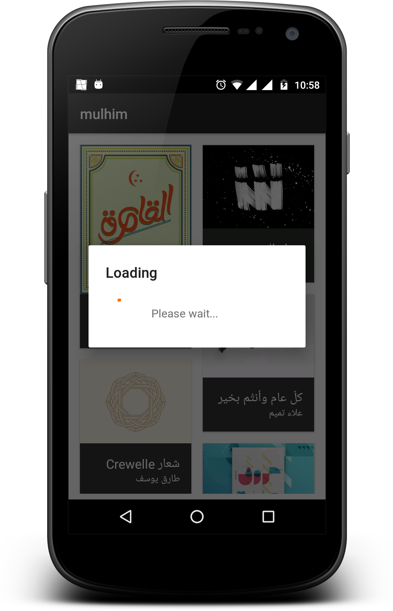
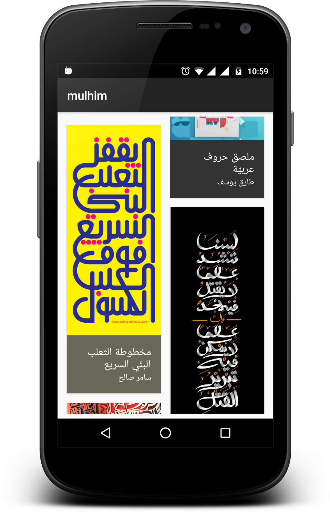
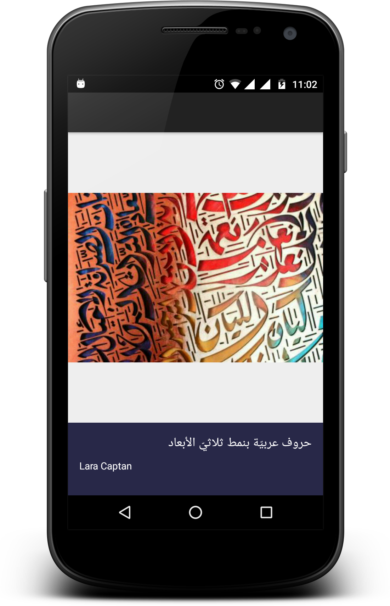
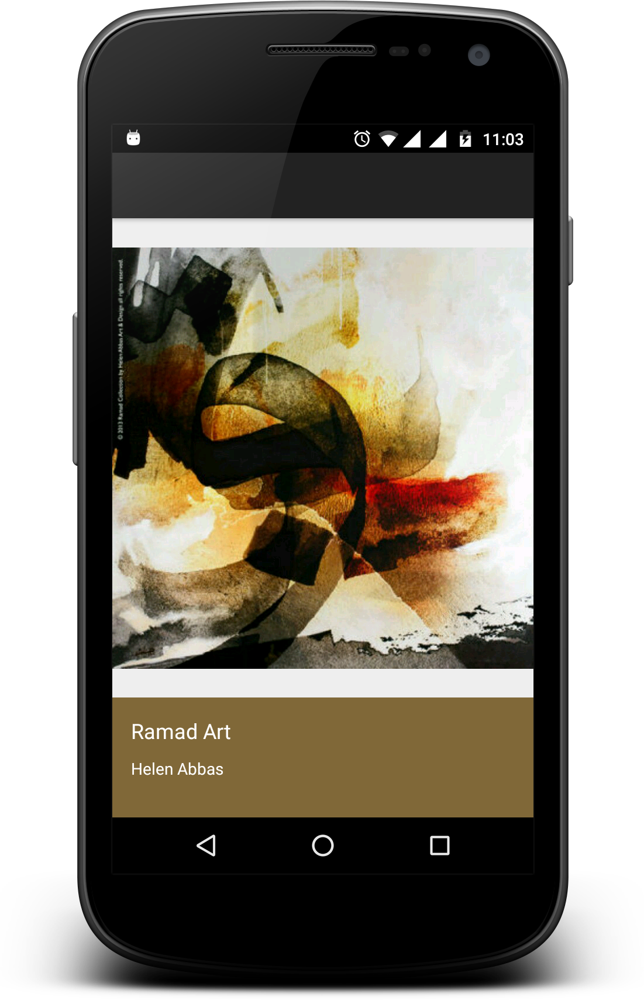
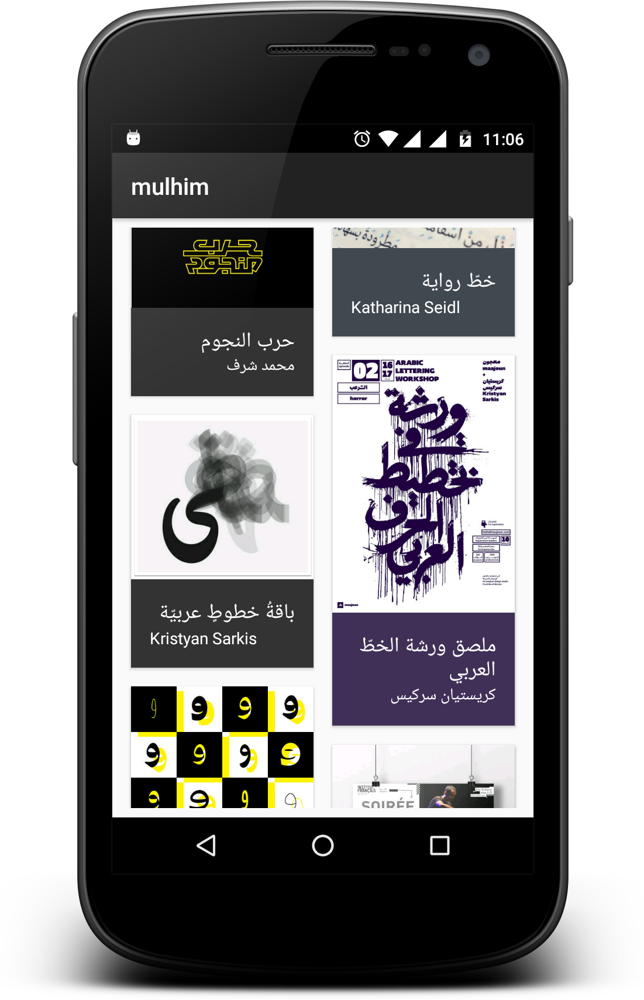

# mulhim
Sample project to practice (Rxjava - Dagger2 - MVP)

mulhim is an Arabic website to inspire artistes and creative people.

- Support libraries
- RecyclerViews and CardViews 
- [RxJava](https://github.com/ReactiveX/RxJava) and [RxAndroid](https://github.com/ReactiveX/RxAndroid) 
- [Retrofit 2](http://square.github.io/retrofit/)
- [Dagger 2](http://google.github.io/dagger/)
- [Butterknife](https://github.com/JakeWharton/butterknife)
- [Timber](https://github.com/JakeWharton/timber)
- [Glide](https://github.com/bumptech/glide)

## Architecture

This Sample project follows ribot's Android architecture guidelines that are based on [MVP (Model View Presenter)](https://en.wikipedia.org/wiki/Model%E2%80%93view%E2%80%93presenter). Read more about them [here](https://github.com/ribot/android-guidelines/blob/master/architecture_guidelines/android_architecture.md). 

##Notes
This is not complete project, I created it for learning purposes, however any ideas or contributions are welcomed.

